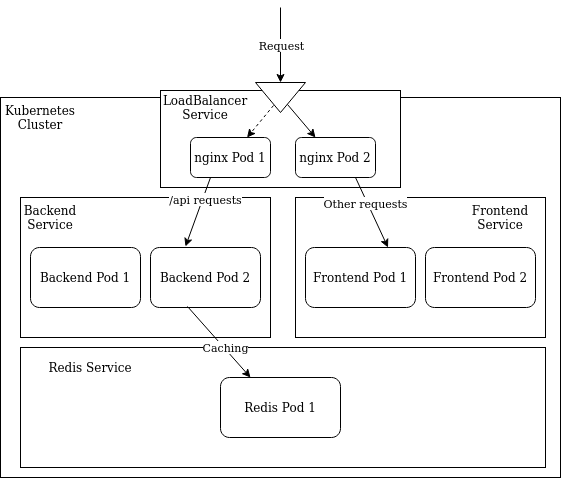

# Creating resources on EKS cluster

This stage is the actual step where we deploy and run the project on the cluster. Since this will be not be a tutorial on the [Kubernetes](https://kubernetes.io) infrastructure or its advantages, we shall not delve into the details of several files used in this stage.

First, clone the following repository: <https://github.com/farisshajahan/k8s-care-manifests>

The repo contains the necessary manifest files required for deploying your care project. The files have been separated into different directories. Take a quick look at the various files in the repo.

We shall now look into what our end deployment looks like.

The requests first come to a LoadBalancer we shall create. This is then balanced across the nginx pods inside our LoadBalancer service. The requests are then routed according to the requested resource. If the route is /api, they are sent to the Backend Service which then distributes it across the Backend pods running __one__ container each with the backend image from ECR. All other requests are sent to the Frontend Service and distributed across the Frontend pods running __one__ container each with the frontend image from ECR.

The services in kubernetes are used to manage deployments. Services are bound to deployments and are responsible for spawning pods using the definitions in the deployments. You can think of deployments like Classes in C++ and pods like Class Instances. The service is also responsible for always making sure a specified number of pods are spawned as defined in it. It is also used to expose the pods inside as a "service" to other services in the cluster.

You will need to modify the following files:

* `backend/deployment.yml`  
    Update the image url to reflect your ECR repo image URL.

* `frontend/deployment.yml`  
    Update the image url to reflect your ECR repo image URL.

* `backend/secrets.yml`  
	Add the secret type environment variables from the previous section in this file.  
	The secret types are those variables which are to be kept secret like AWS_SECRET_ACCESS_KEY.
	The REDIS_URL must be set to `redis://:@redis-cache-production:6379/0`.

* `backend/configmap.yml`  
	Add all other environment variables from the previous section in this file.

* `nginx/nginx.conf`  
	Update your nginx configuration for the web service for your care frontend.

* `nginx/service.yml`  
	Add your domain SSL certificate in AWS ACM, and specify the ARN there

 After making the necessary changes you can apply the configurations to your cluster using `kubectl apply -f <manifest_file>`. You can also apply entire directories as `kubectl apply -f backend/`, `kubectl apply -f frontend/` etc.

Applying nginx/service.yml will automatically create a Load Balancer in AWS. Head over to the AWS EC2 console and go to the Load Balancers subsection. Click on the created load balancer to get its DNS name. Now go to your domain registrar and and map your domain to this DNS name by creating an ALIAS type A record. Wait for a few minutes for the changes to be reflected.  
The Care Network should now be running at your domain URL.
