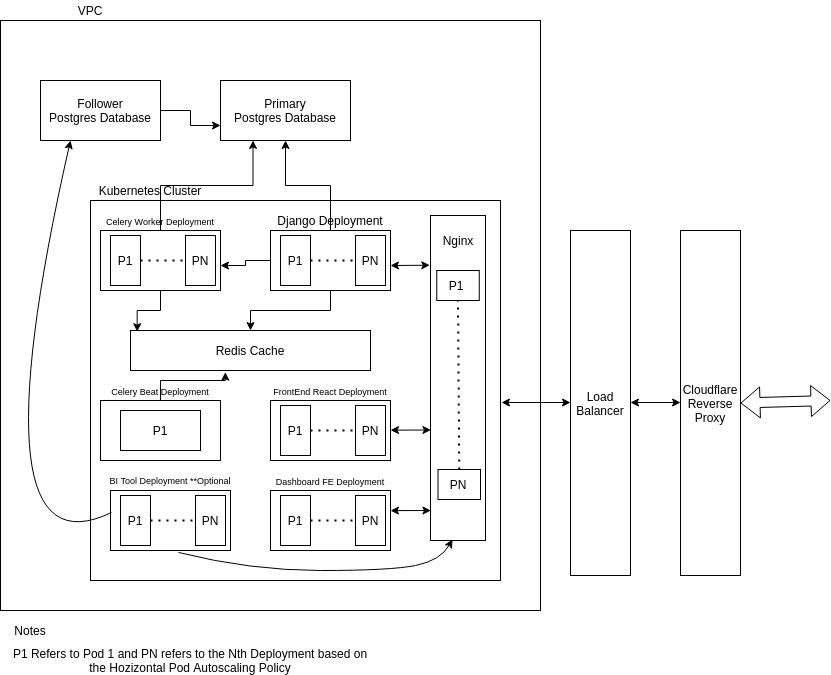

# Deploying the projects on EKS

This stage is the actual step where we deploy and run the project on the cluster. Since this will be not be a tutorial on the [Kubernetes](https://kubernetes.io) infrastructure or its advantages, we shall not delve into the details of several files used in this stage.

First, clone the following repository: [https://github.com/coronasafe/k8-templates](https://github.com/coronasafe/k8-templates)

The repo contains the necessary manifest files required for deploying your care project. The files have been separated into different directories. Take a quick look at the various files in the repo.

We shall now look into what our end deployment looks like.

The requests first come to a LoadBalancer we shall create. This is then balanced across the nginx pods inside our LoadBalancer service. The requests are then routed according to the requested resource. If the route is /api, they are sent to the Backend Service which then distributes it across the Backend pods running **one** container each with the backend image from ECR. All other requests are sent to the Frontend Service and distributed across the Frontend pods running **one** container each with the frontend image from ECR.

The services in kubernetes are used to manage deployments. Services are bound to deployments and are responsible for spawning pods using the definitions in the deployments. You can think of deployments like Classes in C++ and pods like Class Instances. The service is also responsible for always making sure a specified number of pods are spawned as defined in it. It is also used to expose the pods inside as a "service" to other services in the cluster.

  

